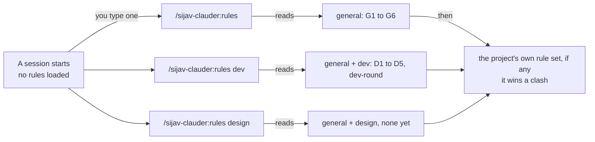
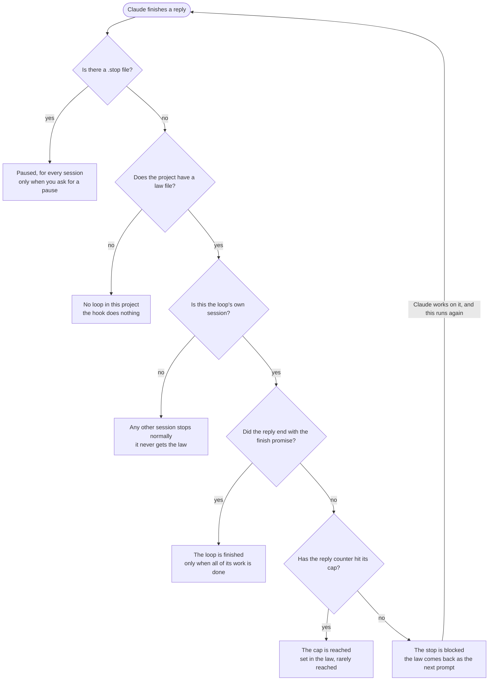
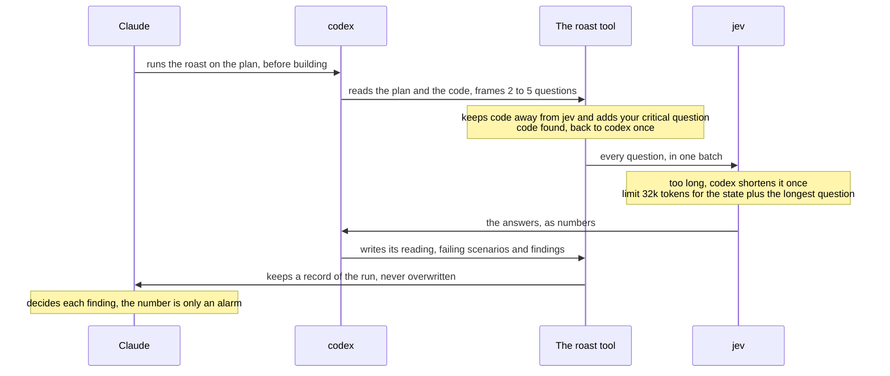
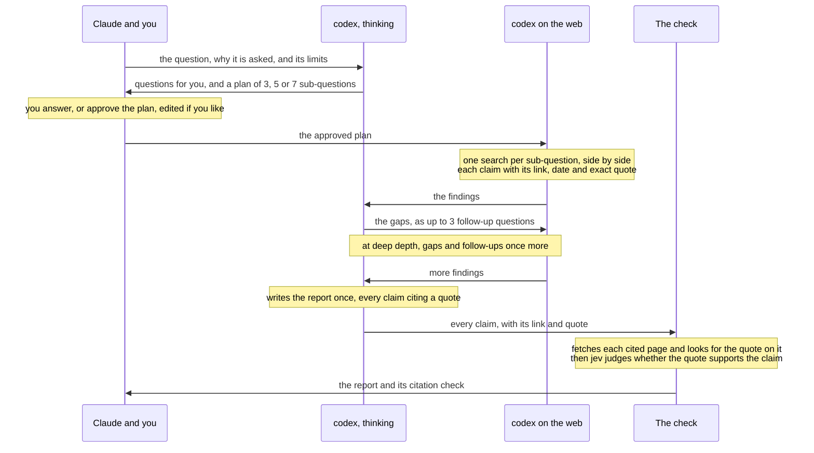

# Sijav Skills

**[Open the guide as a web page: sijav.github.io/Sijav-Skills](https://sijav.github.io/Sijav-Skills/)**

A Claude Code plugin marketplace with one plugin, **sijav-clauder**. Eight skills that work in any project. A new session starts with no rules at all: the rule sets load only when you call them, and each skill loads when its work comes up.

This README and [the web page](https://sijav.github.io/Sijav-Skills/) are the same guide: `python site/build_site.py` writes
both from the skills' own files. Change the skills or `site/build_site.py`, never this file by
hand.

```
Sijav-Skills/                     the marketplace (this git repository)
  .claude-plugin/marketplace.json
  Sijav-Clauder/                  the sijav-clauder plugin
    .claude-plugin/plugin.json
    skills/rules, dev-round, codex, search, research, roast, loop, todo
  site/build_site.py              writes the website and this README
  docs/index.html                 the website, served by GitHub Pages
```

## The eight skills

They ship as one Claude Code plugin, `sijav-clauder`, from a folder that is its own git repository. Plugin skills are called with the plugin's name first. None of them holds a project's rules, names or paths; each project keeps those itself.

| Skill | What it does | When it loads | How you call it |
|---|---|---|---|
| rules | Your rule sets: general, dev and design, plus the current project's own set, and how to change a rule. | Only when you call it | `/sijav-clauder:rules`<br>`/sijav-clauder:rules dev`<br>`/sijav-clauder:rules design` |
| dev-round | How to work through a round of code to-dos: each to-do writes its tests, with an end-to-end test of its story from the user's point of view, without running them; when the area's to-dos are done, its full suite runs at 100% coverage with the end-to-end scenarios, the tests are checked, failures are fixed at the root, and only then is each to-do marked tested and e2e tested. | When you call it or load the dev rules | `/sijav-clauder:dev-round` |
| codex | Calls codex (GPT-6) through one session per kind of work, 6.1 sol at medium effort unless told otherwise. | When a task needs codex | `/sijav-clauder:codex` |
| search | A plain web search: codex on luna at low effort answers one question in a few sentences, with the links it used. | When a fact, a version or a doc page is needed | `/sijav-clauder:search` |
| research | Deep research on astra, like ChatGPT's or Gemini's: questions and a plan you approve, web searches side by side, gap rounds, one cited report, and every quote checked on the page it cites, then judged by jev. | When a question needs many sources | `/sijav-clauder:research` |
| roast | Codex checks a plan or finished work and writes typed questions; jev judges them; codex writes its reading. One record per run. | When a check is wanted | `/sijav-clauder:roast` |
| loop | Engages a project's own loop and follows its law: start, turns, pause, finish. | When you call it | `/sijav-clauder:loop` |
| todo | A project board in a small database, for projects that have opted in. | In those projects | `/sijav-clauder:todo` |

## How rules load

Nothing loads by itself: there is no global rules file and no rule in memory. You call a set when you want it.



*You call one command. It reads the general rules and the set you name, then the project's own rule set when the project has one. Inside that project, a project rule wins over a general rule it clashes with.*

## The rule sets

Each rule has an ID, so you can say which one to keep, change or drop. The text below is read from the rule files themselves.

### General (G · /sijav-clauder:rules)

#### G1. Tell me the truth, plainly

- When I ask why something happened, answer with the mechanism: the file, the line, the command, the condition that fired. Not an excuse, not an apology, not my own words handed back.
- "I don't know" is a correct answer. Without evidence (a log, a timestamp, output), say you don't know, then go and get the evidence if you can.
- Never invent an authority. If nothing told you to do it, say so. If something did, quote it.
- Don't just agree with me. If I am wrong, say so and show what happened.
- In reports, keep evidence, guesses and unknowns apart.

#### G2. Newer instructions win; old ones get deleted

Every instruction has a date. The newer one wins, by its intent. When a new rule replaces an old one, delete the old one in the same edit, so no file keeps both. If you notice two written rules that clash, follow the newer one and name the clash in one line. Between a general rule and a project rule, the project rule wins in its own project, whatever their dates.

Temporary rules are the one exception. They live only in a project's own files. Each says what it overrides and its exit condition. It does not delete the old rule. When the exit condition is met, delete the temporary rule; the old rule applies again.

#### G3. When I ask a question, check twice

1. Check my question: what am I really asking, and is anything it assumes wrong?
2. Draft the answer, then check it: is every fact checked now (command run, file read)? Is anything missing or softened? What would the other side say?
3. Answer first, then show what you checked, each part under its own label.

Only for my questions, not every turn or task. This is your own check, not another model's.

#### G4. Ask me only when the decision is really mine

Ask me only when the decision is really mine or only I can do it: money, deleting or publishing, access and accounts, product choices the code and my words don't settle. Ask those through the question card. A rule set can give you standing permission for one of these, as D5 does for pushes by phase; then act without asking. Everything else: decide, do it, then tell me what you did and what you suggest next.

Don't add gates, scores or approval steps I didn't ask for.

#### G5. Do what I asked, and finish it

Do the work I asked for, and nothing I didn't ask for. Finish what you said you would do before switching to something else, unless I change the priority; if you can't, say why.

When I say stop, stop the action I mean, right away. If it is unclear which one, stop the current action and ask. An interrupted command is only that command: check its state and keep pending work; don't take it as a pause.

#### G6. Replies in labeled sections

Answer first. Then say everything that matters, at normal length, split into sections, each with a label that says what it is about, so I know what I am reading. Use full paths (or send the file) and item titles, never bare item numbers. Put results in tables in the reply. Explain a technical word the first time you use it.

### Development (D · /sijav-clauder:rules dev)

#### D1. Keep the full output of commands

Capture every long or background command's full output (stdout and stderr) in a log file from the moment it starts. Never cut output with `tail` or `head` before it is saved; read excerpts from the saved log. Note the command, folder, start time and exit status in the log.

#### D2. Never run the same work twice

Before starting or retrying a command, check whether the same work is already running: look at full command lines, not process names. A timeout, silence or an empty process search means "unknown", not "finished". Stop only runs you started, and check that they really ended. When a monitor tails a log with `tail -F`, wrap it in `timeout` shorter than the monitor's own timeout.

#### D3. Failures

Tools you write print the exact cause of each failure. A failing check is a result to act on. Investigate a failure with the logs, exit codes and timestamps you have before retrying. Never re-run a check just to change its answer, and never repeat an exhausted check without a new lead.

#### D4. Tests and rounds of to-dos

In the sijav-clauder:dev-round skill (moved there on 2026-09-28). Use it for every code to-do.

#### D5. Branches and pushes, by phase

- MVP: push to main after every to-do. No checks, and don't ask.
- Phase 0 (fixing the MVP): push to development; when phase 0 is done, development goes to main.
- After phase 0: development, staging and main. When a story is done, push development to staging. Pushing to main is the owner's, unless the owner tells Claude to do it.
- No other check before a push.
- Each project's rule set says which phase it is in.

### dev-round (skill · /sijav-clauder:dev-round, or with the dev rules)

A round is one area's to-dos that were open when it started: the front in general, or the back in general (a project may name its areas). Follow-ups found during it wait for the area's next round.

#### Each to-do

- Build it, and write its tests with it. Test code only; don't write tests for rules, prompts or prose.
- Tests follow written scenarios from the user's point of view: real-world, logical, and many of them. By the end of the round, together they cover 100% of the area's code, and the users' journeys end to end.
- Each to-do's story gets its own end-to-end test, from the point of view of the person in the story: what they do, from where they start to what they see at the end. Write it with the to-do; it runs with the rest when the round is done.
- Done is not tested. When the project keeps its to-dos on a board, each to-do also has two statuses that start false: tested, once its tests pass, and e2e tested, once it has been tested as a real user, in a real user scenario, not just its exit condition.
- Run no tests during the round: not the tests you just wrote, not the ones near the code you changed, not coverage, not end-to-end runs, not planted faults, not the full suite. The worry that a change broke something else is what the round-end pass is for.
- The one exception: when the project closes a to-do by running its exit check (a loop's close command, for example), that one command runs, and nothing else.

#### When the round is done

When every to-do of the area's round is done:

1. Run the area's full test suite, with coverage (it must reach 100%) and the end-to-end scenarios.
2. Check the tests themselves: each to-do's story has its end-to-end test, and each test follows a real scenario, its steps and checks match what the user does and sees, and it fails when the behaviour it guards breaks (plant a fault to see it fail when in doubt). Fix a test that is wrong or illogical, and say which and why.
3. When a scenario fails, find which one and why its logic fails, and fix the root cause in the code. Never change a test just to make it pass; change it only when its scenario was wrong, and say so.
4. Mark each to-do on the board: tested once its tests pass, and e2e tested once it has been tested as a real user, in a real user scenario.
5. Then start the area's next round with its follow-ups.

Branches and pushes follow the project's phase: the dev rules, D5 (/sijav-clauder:rules dev).

### Design (S · /sijav-clauder:rules design)

No design rules yet.

## The loop

A project can run a loop: after each reply, its Stop hook gives the project's law back as the next prompt, until the work is done. The loop skill engages that loop and follows the law. Starting it is the project's own command, run from the session that should do the work: that session becomes the loop's only session, and the pause file goes.



*What a project's Stop hook checks after every reply, in this order. Every "may stop" exit ends the loop for that reply; only the session that started the loop ever gets the law back.*

#### Start

Type `/sijav-clauder:loop` in the session that should do the work. The project's start command makes it the loop's only session and removes the pause file.

#### Pause

A `.stop` file in the project pauses the loop. Claude makes one only when you ask; a used-up codex allowance means asking you to switch accounts, not pausing.

#### Finish

The reply ends with the law's finish promise only when all work is closed: no open, parked or failing items left.

## The roast

A second engineer pushes back on the work. Codex does the pushing, jev (TypeSafe's judge model) weighs the logic, and Claude decides. It runs once per plan before building; small, clear fixes skip it.



*One plan roast. Jev only ever sees logic in plain words: the plan's steps and reasons, the facts codex checked, and what you asked for in your own words. Code stays with codex and Claude.*

### Reading a roast

- The record has five parts: what was asked, the facts codex checked with their sources, jev's answers as numbers, codex's reading (its own interpretation, not jev's), and a place to write what happened to each finding.
- A yes-or-no answer from jev is a probability and has no confidence. The confidence on a choice or a score only says how concentrated its probabilities are.
- A finding is critical only if it would definitely break the whole thing asked for, must be fixed right away, and is neither a later task nor a feature. The failing scenario decides that, not jev's number.
- No automatic second roast. A changed plan is checked against the facts before building.
- Without jev (switched off, no key, or jev failing during the run), codex reviews alone and the record says why. With codex switched off there is no roast: Claude reviews the work itself.

### What a replay on 12 past plans showed

|  | Old judge-only check | Codex alone | Codex with jev |
|---|---|---|---|
| Real problems named, of 18 | 0 | 4 | 5 |
| False objections | 3 | 14 | 11 to 12 |
| Critical call right, of 12 | 7 | 7 | 6 |
| Time per plan | 0.4 s | 40 s | 82 s |

Each check saw only the plan as it was before its first check. Two blind scorers agreed on 53 of 54 verdicts. Jev's critical number was 0.5 or more on all three sound plans, which is why it only ever raises an alarm. Twelve plans is a small sample, and each check ran once.

## Codex

- One codex session per kind of work, such as research or a roast mode. A call with the same purpose resumes that session, so codex keeps the context of that line of work.
- Models: `gpt-6.1-sol` at medium effort by default (it needs codex 0.159 or newer), `gpt-6-astra` for research (the roast's search mode and the research skill, at high effort) or when you ask for it, `gpt-6-luna` for fast, cheap tasks, such as a plain web search at low effort. A session keeps its thread when the model changes.
- All GPT-6 models share one allowance. When it runs out, Claude asks you to switch the codex account, then continues in the same session. No pause, and no reserve model, except for a plain web search: it runs once more on `gpt-reserve`, a luna that stays free when the allowance is used up.
- Every call keeps its full log in the project it ran for.
- This skill holds no codex token: codex signs in with its own login, which you manage.

## Search and research

**Search** and **research** are separate skills. Search is a plain web lookup: one question to codex on `gpt-6-luna` at low effort, answered in a few sentences with the links it used; when the allowance is used up, it runs on `gpt-reserve`, which stays free. Research is deep research on `gpt-6-astra`, like ChatGPT's and Gemini's, for a question that needs many sources and judgement; it checks every citation on the page it cites before you read the report.



*One research run at standard depth. It stops after the plan so you can answer codex's questions and approve the plan. Each search is its own fresh codex conversation, so they run side by side, and every step is saved, so a run that stops resumes where it stopped.*

- **Questions and the plan first:** codex lists what is unclear and writes the plan, and the run stops there, as ChatGPT asks first and Gemini shows its plan. Your answers make a new plan; an approved plan, edited if you like, goes on with `--resume`. `--go` skips the stop.
- **One pass:** the report is written once, from the findings only, so it reads as one piece. It says where sources disagree and what stays uncertain.
- **The check:** each cited page is fetched afresh and the quote is looked for on it; then jev judges whether the quote supports its claim. Jev's number is a probability: 0.65 or more is supported, 0.35 or less is not, and between is unclear. A quote that is not on its own page never counts, whatever jev says.
- **Nothing is lost:** every step is saved in the project. A run that stops, because codex fails or its allowance runs out, resumes from the last finished step without searching again.
- **Pages are data:** the findings reach the later steps fenced off as quoted material, and an instruction found on a web page is never followed.
- Without jev the quotes are still checked on their pages. With codex switched off nothing is sent, and Claude researches with its own tools and says so.

## The board

- A small database inside each project that opts in. The skill refuses to make a board where none exists.
- In those projects it replaces the built-in to-do list: the next task, new tasks, status changes, and anything found along the way.
- Ids keep the board's own prefix. A roast's findings become children of the task they came from.
- Two versions of the tool, one for Node and one for Python, give the same output byte for byte.

## What a project adds

The bundle holds none of these; each project keeps its own, inside its `.claude` folder.

- **Its rules:** a file in `.claude/rulesets`, read by `/sijav-clauder:rules` in that project. A project rule wins over a general rule it clashes with.
- **Its loop:** a law file named `<name>-loop.local.md`, the hooks that give it back after each reply and after a compaction, and the command that starts it.
- **Its board:** `todo.db`, for the todo skill.
- **Its records:** codex sessions and roast records are written into the project, never into the skills folder.

## Set up codex and jev

Most of the skills need nothing more than Claude Code. Two need a service you set up once: **codex**, which reviews work and searches the web (the codex, search, research and roast skills), and **jev**, TypeSafe's judge (the roast, and the research's citation check). Either can be switched off, and the skills then work without it. Also needed: Python 3.13, Node 22.13 or newer, and `uv` for the tests.

### codex

1. Install the codex command line: `npm install -g @openai/codex`.
2. Sign in once, yourself: run `codex` in a terminal and follow its sign-in. The skills never sign in for you and hold no codex token.
3. Check it: `codex --version` prints a version. The skills find `codex` on your PATH.

**Switch it off** with `SIJAV_CODEX=off`: the codex runner, search, research and the roast start nothing, and Claude does the work itself with its own tools. **Switch it back on** by removing the setting, or setting it to `on`.

### jev (TypeSafe)

1. Get an API key from TypeSafe (docs.typesafe.ai).
2. Save it in a file of its own, **outside the plugin's folder**: Claude Code copies an installed plugin into its own cache, files and all.
3. Install the library into the Python that runs the skills, the `python` on your PATH: `python -m pip install typesafe-sdk`. Check it with `python -c "import typesafe_sdk"`, which prints nothing when it works.
4. Point the skills at the key: set `SIJAV_JEV_KEY_FILE` to the key file's full path. Without it, the roast reads `TYPESAFE_API_KEY`.
5. Check it end to end: run one roast (`/sijav-clauder:roast`). The record's jev line names the jev model that answered, or says why jev was not used.

**Switch it off** with `SIJAV_JEV=off`: the roast runs with codex alone, and its record says why; research still checks every quote on its page, and its check says jev did not judge them. It does the same by itself when there is no key, the library is missing, or jev fails during a run. **Switch it back on** by removing the setting, or setting it to `on`.

### Where the settings go

In Claude Code's settings, under `env`: your user settings file for every project, or a project's `.claude/settings.json` for that project only. For example, with the key set and codex switched off:

```json
{
  "env": {
    "SIJAV_JEV_KEY_FILE": "/full/path/to/typesafe.key",
    "SIJAV_CODEX": "off"
  }
}
```

`off`, `0`, `false` or `no` switches a service off; any other value, or no setting at all, leaves it on. Start a new session after changing a setting.

## Install

The plugin comes from the `Sijav-Skills` marketplace, which holds it and its git history. Run these once in a terminal, then start a new session:

```sh
claude plugin marketplace add sijav/Sijav-Skills
claude plugin install sijav-clauder@sijav-skills
```

To work on the skills themselves, clone the repository and add the local folder instead: `claude plugin marketplace add <your clone>`. The source is at [https://github.com/sijav/Sijav-Skills](https://github.com/sijav/Sijav-Skills).

To pick up a newer version later, run these, then start a new session or run `/reload-plugins`:

```sh
claude plugin marketplace update sijav-skills
claude plugin update sijav-clauder@sijav-skills
```

Claude Code keeps its own copy of an installed plugin, every file in the plugin's folder included, so keep keys outside it. After changing the skills in a clone, raise the plugin's version and run the update.

## Changing a rule

Every rule set has a `log.md` next to it: the history of each rule, with the old text, why it existed, the owner's words and the evidence. The log is the guard; nobody else has to approve a rule.

1. Find the rule by its ID (G1, D2, or a project rule's ID) and its file.
2. Read its entries in that folder's `log.md`.
3. If the change would bring back a problem recorded there, or goes against the owner's words, ask the owner first. Otherwise go ahead.
4. Back up the file first: copy it into a dated backup folder with a `.bak` ending, outside any `.claude` folder, so the copy can never load as a rule.
5. Edit it, and delete the old rule in the same edit. A rule lives in one place only.
6. Add a log entry: date, rule ID, old text, new text, the owner's words and the evidence.

Rules do not go into CLAUDE.md or memory files: those load into every session.

## Tests

From `Sijav-Clauder/skills`:

- `uv run --no-project --with pytest --with typesafe-sdk python -m pytest codex/test_codex_session.py codex/test_copy_session.py loop/test_compact.py research/test_research.py roast/test_roast.py search/test_search.py -q`
- `python todo/test-parity.py`
- `node todo/test-subtasks.mjs`

## The website and this README

`python site/build_site.py` writes `docs/index.html`, which GitHub Pages serves from the
`docs` folder of `main`, and this README, both from the skills' own files. Rebuild and commit
them after changing a rule or a skill. The build refuses to write either when it finds a
project's name, a person's name or a local path, and checks every tracked file for private
words.

## Keeping it clean

- No project names, paths or project rules go into the skills; they belong to the project.
- Change a rule the way `rules/SKILL.md` says, and log it in `rules/log.md`. That log is the
  history of each rule, so it keeps the evidence it was written from.
