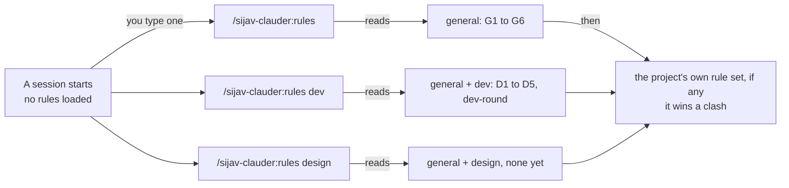
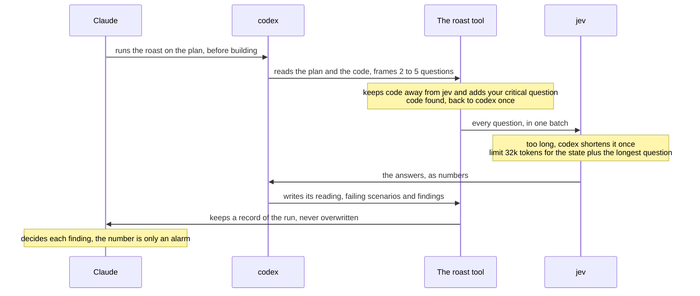
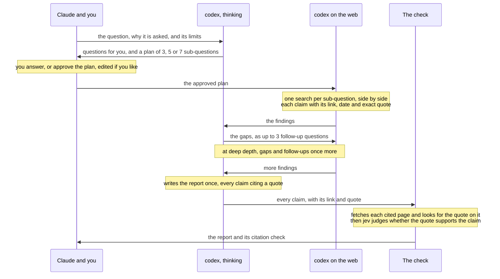
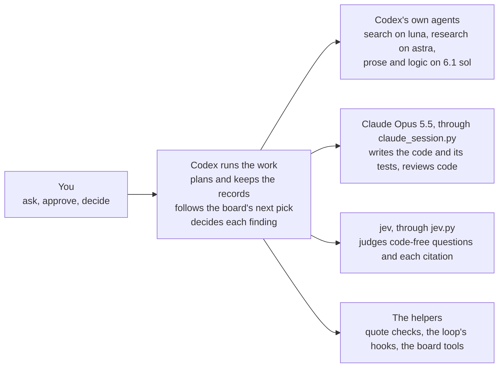
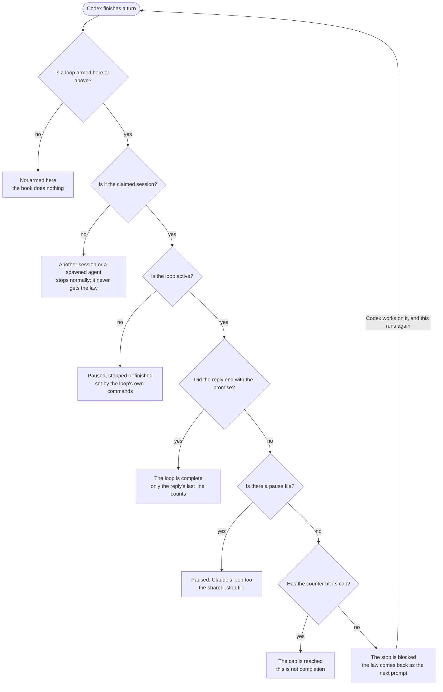
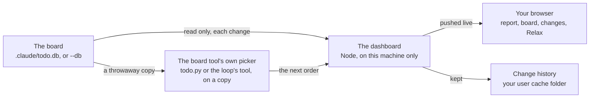

# Sijav Skills

**[Open the guide as a web page: sijav.github.io/Sijav-Skills](https://sijav.github.io/Sijav-Skills/)**

The same eight skills, twice: **sijav-clauder**, a Claude Code plugin in this marketplace, and
**sijav-codex**, a native Codex plugin in its own folder. Eight skills that work in any project, in Claude Code and in Codex. A new session starts with no rules at all: the rule sets load only when you call them, and each skill loads when its work comes up. Both plugins can work on the same project, sharing its board, its rules and its loop's law.

This README and [the web page](https://sijav.github.io/Sijav-Skills/) are the same guide: `python site/build_site.py` writes
both from the skills' own files. Change the skills or `site/build_site.py`, never this file by
hand.

```
Sijav-Skills/                     the marketplace (this git repository)
  .claude-plugin/marketplace.json
  Sijav-Clauder/                  the sijav-clauder plugin
    .claude-plugin/plugin.json
    skills/rules, dev-round, codex, search, research, roast, loop, todo
  Sijav-Codex/                    the sijav-codex plugin, installed from this folder
    .codex-plugin/plugin.json
    .agents/plugins/marketplace.json
    hooks/hooks.json              the loop's Stop and SessionStart hooks
    skills/rules, dev-round, agents, search, research, roast, loop, todo
    skills/todo/dashboard/        the board's read-only dashboard
    tools/sijav_codex_setup.py    checks the package and installs it with codex
  site/build_site.py              writes the website and this README
  docs/index.html                 the website, served by GitHub Pages
```

## The eight skills

They ship as one Claude Code plugin, `sijav-clauder`, from a folder that is its own git repository. Plugin skills are called with the plugin's name first. None of them holds a project's rules, names or paths; each project keeps those itself. The same eight skills for Codex are in [their own section](#on-codex).

| Skill | What it does | When it loads | How you call it |
|---|---|---|---|
| rules | Your rule sets: general, dev and design, plus the current project's own set, and how to change a rule. | Only when you call it | `/sijav-clauder:rules`<br>`/sijav-clauder:rules dev`<br>`/sijav-clauder:rules design` |
| dev-round | How to work through an area's code to-dos in three passes: build them all, with the findings that turn up, writing their tests and running none; then test the area at 100% coverage and mark what passed as tested; then test each as a real user, one end-to-end test per story, and mark it e2e tested. | When you call it or load the dev rules | `/sijav-clauder:dev-round` |
| codex | Calls codex (GPT-6) through one session per kind of work, 6.1 sol at medium effort unless told otherwise. | When a task needs codex | `/sijav-clauder:codex` |
| search | A plain web search: codex on luna at low effort answers one question in a few sentences, with the links it used. | When a fact, a version or a doc page is needed | `/sijav-clauder:search` |
| research | Deep research on astra, like ChatGPT's or Gemini's: questions and a plan you approve, web searches side by side, gap rounds, one cited report, and every quote checked on the page it cites, then judged by jev. | When a question needs many sources | `/sijav-clauder:research` |
| roast | Codex checks a plan or finished work and writes typed questions; jev judges them; codex writes its reading. One record per run. | When a check is wanted | `/sijav-clauder:roast` |
| loop | Engages a project's own loop and follows its law: start, turns, pause, finish. | When you call it | `/sijav-clauder:loop` |
| todo | A project board in a small database, for projects that have opted in. | In those projects | `/sijav-clauder:todo` |

## How rules load

Nothing loads by itself: there is no global rules file and no rule in memory. You call a set when you want it.



*You call one command. It reads the general rules and the set you name, then the project's own rule set when the project has one. Inside that project, a project rule wins over a general rule it clashes with.*

## The rule sets

Each rule has an ID, so you can say which one to keep, change or drop. The text below is read from the rule files themselves.

### General (G · /sijav-clauder:rules)

#### G1. Tell me the truth, plainly

- When I ask why something happened, answer with the mechanism: the file, the line, the command, the condition that fired. Not an excuse, not an apology, not my own words handed back.
- "I don't know" is a correct answer. Without evidence (a log, a timestamp, output), say you don't know, then go and get the evidence if you can.
- Never invent an authority. If nothing told you to do it, say so. If something did, quote it.
- Don't just agree with me. If I am wrong, say so and show what happened.
- In reports, keep evidence, guesses and unknowns apart.

#### G2. Newer instructions win; old ones get deleted

Every instruction has a date. The newer one wins, by its intent. When a new rule replaces an old one, delete the old one in the same edit, so no file keeps both. If you notice two written rules that clash, follow the newer one and name the clash in one line. Between a general rule and a project rule, the project rule wins in its own project, whatever their dates.

Temporary rules are the one exception. They live only in a project's own files. Each says what it overrides and its exit condition. It does not delete the old rule. When the exit condition is met, delete the temporary rule; the old rule applies again.

#### G3. When I ask a question, check twice

1. Check my question: what am I really asking, and is anything it assumes wrong?
2. Draft the answer, then check it: is every fact checked now (command run, file read)? Is anything missing or softened? What would the other side say?
3. Answer first, then show what you checked, each part under its own label.

Only for my questions, not every turn or task. This is your own check, not another model's.

#### G4. Ask me only when the decision is really mine

Ask me only when the decision is really mine or only I can do it: money, deleting or publishing, access and accounts, product choices the code and my words don't settle. Ask those through the question card. A rule set can give you standing permission for one of these, as D5 does for pushes by phase; then act without asking. Everything else: decide, do it, then tell me what you did and what you suggest next.

Don't add gates, scores or approval steps I didn't ask for.

#### G5. Do what I asked, and finish it

Do the work I asked for, and nothing I didn't ask for. Finish what you said you would do before switching to something else, unless I change the priority; if you can't, say why.

When I say stop, stop the action I mean, right away. If it is unclear which one, stop the current action and ask. An interrupted command is only that command: check its state and keep pending work; don't take it as a pause.

#### G6. Replies in labeled sections

Answer first. Then say everything that matters, at normal length, split into sections, each with a label that says what it is about, so I know what I am reading. Use full paths (or send the file) and item titles, never bare item numbers. Put results in tables in the reply. Explain a technical word the first time you use it.

### Development (D · /sijav-clauder:rules dev)

#### D1. Keep the full output of commands

Capture every long or background command's full output (stdout and stderr) in a log file from the moment it starts. Never cut output with `tail` or `head` before it is saved; read excerpts from the saved log. Note the command, folder, start time and exit status in the log.

#### D2. Never run the same work twice

Before starting or retrying a command, check whether the same work is already running: look at full command lines, not process names. A timeout, silence or an empty process search means "unknown", not "finished". Stop only runs you started, and check that they really ended. When a monitor tails a log with `tail -F`, wrap it in `timeout` shorter than the monitor's own timeout.

#### D3. Failures

Tools you write print the exact cause of each failure. A failing check is a result to act on. Investigate a failure with the logs, exit codes and timestamps you have before retrying. Never re-run a check just to change its answer, and never repeat an exhausted check without a new lead.

#### D4. Tests and rounds of to-dos

In the sijav-clauder:dev-round skill (moved there on 2026-09-28). Use it for every code to-do.

#### D5. Branches and pushes, by phase

- MVP: push to main after every to-do. No checks, and don't ask.
- Phase 0 (fixing the MVP): push to development; when phase 0 is done, development goes to main.
- After phase 0: development, staging and main. When a story is done, push development to staging. Pushing to main is the owner's, unless the owner tells Claude to do it.
- No other check before a push.
- Each project's rule set says which phase it is in.

### dev-round (skill · /sijav-clauder:dev-round, or with the dev rules)

Work area by area: the front in general, or the back in general (a project may name its areas). Each area goes through three passes in order, and goes back to the first whenever work turns up. Done is not tested: when the project keeps its to-dos on a board, each to-do has two statuses that start false, tested and e2e tested.

#### 1. Build

- Take the area's to-dos, and every follow-up or finding that becomes a to-do on the way, until none is left.
- Build each one and write its tests with it. Test code only; don't write tests for rules, prompts or prose.
- Tests follow written scenarios from the user's point of view: real-world, logical, and many of them. Together they cover 100% of the area's code.
- Run no tests while building: not the tests you just wrote, not the ones near the code you changed, not coverage, not end-to-end runs, not planted faults, not the full suite. The worry that a change broke something else is what the test pass is for.
- The one exception: when the project closes a to-do by running its exit check (a loop's close command, for example), that one command runs, and nothing else.

#### 2. Test

When none of the area's to-dos is left:

1. Run the area's full test suite, with coverage (it must reach 100%).
2. Check the tests themselves: each follows a real scenario, its steps and checks match what the user does and sees, and it fails when the behaviour it guards breaks (plant a fault to see it fail when in doubt). Fix a test that is wrong or illogical, and say which and why.
3. When a scenario fails, find which one and why its logic fails, and fix the root cause in the code. Never change a test just to make it pass; change it only when its scenario was wrong, and say so.
4. Mark every done to-do whose tests passed and that was never tested: tested.
5. Work the test pass turns up becomes to-dos: build them (1) and test again, until a test pass turns up nothing new.

#### 3. Test as a real user

When all the area's to-dos are done and tested:

1. Test each to-do as a real user, in a real user scenario: what the person does, from where they start to what they see at the end; not just its exit check. To-dos with the same story share one end-to-end test.
2. Mark every to-do that test covers: e2e tested.
3. Whatever fails becomes a to-do: build it (1), test it (2) and test it as a real user again.

A to-do that changes no code (a decision, a document, research) has no tests: mark it in each pass with how its result was checked.

Branches and pushes follow the project's phase: the dev rules, D5 (/sijav-clauder:rules dev).

### Design (S · /sijav-clauder:rules design)

No design rules yet.

## The loop

A project can run a loop: after each reply, a Stop hook gives the loop's law back as the next prompt, until the work is done. The loop skill engages that loop and follows the law. Starting it is the project's own command, run from the session that should do the work: that session becomes the loop's only session, and the pause file goes.

A loop is per session, so a project can run several at once. Each has its own loop file, `<name>-loop.local.md`, naming its session, its board and its areas. The project's own hook drives its loop; a loop file that says `driver: skill` is driven by the loop skill's own hooks, which run only in the session that invoked the skill. No loop ever gets another loop's law.


*What a project's Stop hook checks after every reply, in this order. Every "may stop" exit ends the loop for that reply; only the session that started the loop ever gets the law back.*

#### Start

Type `/sijav-clauder:loop` in the session that should do the work. The project's start command makes it the loop's only session and removes the pause file.

#### Areas

The loop file's `areas:` are the only work its session gets: the to-do script reads them on every command, so `next` offers nothing else and a task outside them cannot be started.

#### Pause

A `.stop` file in the project pauses every loop; `.claude/<loop file>.stop` pauses one. Claude makes one only when you ask; a used-up codex allowance means asking you to switch accounts, not pausing.

#### Finish

The reply ends with the law's finish promise only when all work is closed: no open, parked or failing items left.

## The roast

A second engineer pushes back on the work. Codex does the pushing, jev (TypeSafe's judge model) weighs the logic, and Claude decides. It runs once per plan before building; small, clear fixes skip it.



*One plan roast. Jev only ever sees logic in plain words: the plan's steps and reasons, the facts codex checked, and what you asked for in your own words. Code stays with codex and Claude.*

### Reading a roast

- The record has five parts: what was asked, the facts codex checked with their sources, jev's answers as numbers, codex's reading (its own interpretation, not jev's), and a place to write what happened to each finding.
- A yes-or-no answer from jev is a probability and has no confidence. The confidence on a choice or a score only says how concentrated its probabilities are.
- A finding is critical only if it would definitely break the whole thing asked for, must be fixed right away, and is neither a later task nor a feature. The failing scenario decides that, not jev's number.
- No automatic second roast. A changed plan is checked against the facts before building.
- Without jev (switched off, no key, or jev failing during the run), codex reviews alone and the record says why. With codex switched off there is no roast: Claude reviews the work itself.

### What a replay on 12 past plans showed

|  | Old judge-only check | Codex alone | Codex with jev |
|---|---|---|---|
| Real problems named, of 18 | 0 | 4 | 5 |
| False objections | 3 | 14 | 11 to 12 |
| Critical call right, of 12 | 7 | 7 | 6 |
| Time per plan | 0.4 s | 40 s | 82 s |

Each check saw only the plan as it was before its first check. Two blind scorers agreed on 53 of 54 verdicts. Jev's critical number was 0.5 or more on all three sound plans, which is why it only ever raises an alarm. Twelve plans is a small sample, and each check ran once.

## Codex

- One codex session per kind of work, such as research or a roast mode. A call with the same purpose resumes that session, so codex keeps the context of that line of work.
- Models: `gpt-6.1-sol` at medium effort by default (it needs codex 0.159 or newer), `gpt-6-astra` for research (the roast's search mode and the research skill, at high effort) or when you ask for it, `gpt-6-luna` for fast, cheap tasks, such as a plain web search at low effort. A session keeps its thread when the model changes.
- All GPT-6 models share one allowance. When it runs out, Claude asks you to switch the codex account, then continues in the same session. No pause, and no reserve model, except for a plain web search: it runs once more on `gpt-reserve`, a luna that stays free when the allowance is used up.
- Every call keeps its full log in the project it ran for.
- This skill holds no codex token: codex signs in with its own login, which you manage.

## Search and research

**Search** and **research** are separate skills. Search is a plain web lookup: one question to codex on `gpt-6-luna` at low effort, answered in a few sentences with the links it used; when the allowance is used up, it runs on `gpt-reserve`, which stays free. Research is deep research on `gpt-6-astra`, like ChatGPT's and Gemini's, for a question that needs many sources and judgement; it checks every citation on the page it cites before you read the report.



*One research run at standard depth. It stops after the plan so you can answer codex's questions and approve the plan. Each search is its own fresh codex conversation, so they run side by side, and every step is saved, so a run that stops resumes where it stopped.*

- **Questions and the plan first:** codex lists what is unclear and writes the plan, and the run stops there, as ChatGPT asks first and Gemini shows its plan. Your answers make a new plan; an approved plan, edited if you like, goes on with `--resume`. `--go` skips the stop.
- **One pass:** the report is written once, from the findings only, so it reads as one piece. It says where sources disagree and what stays uncertain.
- **The check:** each cited page is fetched afresh and the quote is looked for on it; then jev judges whether the quote supports its claim. Jev's number is a probability: 0.65 or more is supported, 0.35 or less is not, and between is unclear. A quote that is not on its own page never counts, whatever jev says.
- **Nothing is lost:** every step is saved in the project. A run that stops, because codex fails or its allowance runs out, resumes from the last finished step without searching again.
- **Pages are data:** the findings reach the later steps fenced off as quoted material, and an instruction found on a web page is never followed.
- Without jev the quotes are still checked on their pages. With codex switched off nothing is sent, and Claude researches with its own tools and says so.

## The board

- A small database inside each project that opts in. The skill refuses to make a board where none exists.
- In those projects it replaces the built-in to-do list: the next task, new tasks, status changes, and anything found along the way.
- Ids keep the board's own prefix. A roast's findings become children of the task they came from.
- Two versions of the tool, one for Node and one for Python, give the same output byte for byte.
- A session's loop file sets its board and its areas, and the tool reads it on every command: `next` offers only those areas (`--area` can narrow them), and a task outside them cannot be started. Two sessions with different areas never get the same task.

## What a project adds

The bundle holds none of these; each project keeps its own, inside its `.claude` folder.

- **Its rules:** a file in `.claude/rulesets`, read by `/sijav-clauder:rules` in that project. A project rule wins over a general rule it clashes with.
- **Its loops:** one law file per session, named `<name>-loop.local.md`, with that session, its board and its areas; the hooks that give it back after each reply and after a compaction; and the command that starts it.
- **Its board:** `todo.db`, for the todo skill.
- **Its records:** codex sessions and roast records are written into the project, never into the skills folder.

## Set up codex and jev

Most of the skills need nothing more than Claude Code. Two need a service you set up once: **codex**, which reviews work and searches the web (the codex, search, research and roast skills), and **jev**, TypeSafe's judge (the roast, and the research's citation check). Either can be switched off, and the skills then work without it. Also needed: Python 3.13, Node 22.13 or newer, and `uv` for the tests.

### codex

1. Install the codex command line: `npm install -g @openai/codex`.
2. Sign in once, yourself: run `codex` in a terminal and follow its sign-in. The skills never sign in for you and hold no codex token.
3. Check it: `codex --version` prints a version. The skills find `codex` on your PATH.

**Switch it off** with `SIJAV_CODEX=off`: the codex runner, search, research and the roast start nothing, and Claude does the work itself with its own tools. **Switch it back on** by removing the setting, or setting it to `on`.

### jev (TypeSafe)

1. Get an API key from TypeSafe (docs.typesafe.ai).
2. Save it in a file of its own, **outside the plugin's folder**: Claude Code copies an installed plugin into its own cache, files and all.
3. Install the library into the Python that runs the skills, the `python` on your PATH: `python -m pip install typesafe-sdk`. Check it with `python -c "import typesafe_sdk"`, which prints nothing when it works.
4. Point the skills at the key: set `SIJAV_JEV_KEY_FILE` to the key file's full path. Without it, the roast reads `TYPESAFE_API_KEY`.
5. Check it end to end: run one roast (`/sijav-clauder:roast`). The record's jev line names the jev model that answered, or says why jev was not used.

**Switch it off** with `SIJAV_JEV=off`: the roast runs with codex alone, and its record says why; research still checks every quote on its page, and its check says jev did not judge them. It does the same by itself when there is no key, the library is missing, or jev fails during a run. **Switch it back on** by removing the setting, or setting it to `on`.

### Where the settings go

In Claude Code's settings, under `env`: your user settings file for every project, or a project's `.claude/settings.json` for that project only. For example, with the key set and codex switched off:

```json
{
  "env": {
    "SIJAV_JEV_KEY_FILE": "/full/path/to/typesafe.key",
    "SIJAV_CODEX": "off"
  }
}
```

`off`, `0`, `false` or `no` switches a service off; any other value, or no setting at all, leaves it on. Start a new session after changing a setting.

## Install

The plugin comes from the `Sijav-Skills` marketplace, which holds it and its git history. Run these once in a terminal, then start a new session:

```sh
claude plugin marketplace add sijav/Sijav-Skills
claude plugin install sijav-clauder@sijav-skills
```

To work on the skills themselves, clone the repository and add the local folder instead: `claude plugin marketplace add <your clone>`. The source is at [https://github.com/sijav/Sijav-Skills](https://github.com/sijav/Sijav-Skills).

To pick up a newer version later, run these, then start a new session or run `/reload-plugins`:

```sh
claude plugin marketplace update sijav-skills
claude plugin update sijav-clauder@sijav-skills
```

Claude Code keeps its own copy of an installed plugin, every file in the plugin's folder included, so keep keys outside it. After changing the skills in a clone, raise the plugin's version and run the update.

## The same skills on Codex

The repository also holds `sijav-codex`: the same eight skills as a native Codex plugin, in its `Sijav-Codex` folder. Codex runs the work and hands each job to its owner. Claude Opus 5.5 alone writes code and tests and reviews code; Codex's own agents do the rest of the delegated work; jev judges logic, never code.



*Who does what on Codex. Codex never writes or reviews code; Claude does, through its helper. Jev only ever sees logic in plain words.*

| Skill | What it does | When it loads | How you call it |
|---|---|---|---|
| rules | The same rule sets, read from the same files: general, dev and design, plus the project's own set. | Only when you call it | `$sijav-codex-rules`<br>`$sijav-codex-rules dev`<br>`$sijav-codex-rules design` |
| dev-round | The same three passes: build, then test, then test as a real user. Claude writes the code and the tests. | When you call it or load the dev rules | `$sijav-codex-dev-round` |
| agents | Hands each job to its owner: non-code work to Codex's own agents on the right model and effort, code and code review to Claude through its helper. It takes the place of the codex skill. | When work is handed out | `$sijav-codex-agents` |
| search | One plain web search by a fresh Codex agent on luna at low effort, answered in a few sentences with its links. | When a fact, a version or a doc page is needed | `$sijav-codex-search` |
| research | Deep research by Codex agents on astra: questions and a plan you approve, searches side by side, gap rounds, one report, and every quote checked on its page, then judged by jev. | When a question needs many sources | `$sijav-codex-research` |
| roast | Failing scenarios for a plan or finished work: Claude reviews the code, a Codex agent frames the logic, jev judges it, and Codex decides each finding. | When a check is wanted | `$sijav-codex-roast` |
| loop | Starts or resumes the project's loop on Codex's own Stop and compaction hooks, following the project's law. | Only when you call it | `$sijav-codex-loop` |
| todo | The project's board, the same small database, and its read-only dashboard in the browser. | In projects that have a board | `$sijav-codex-todo` |

- **Claude is never replaced.** When Claude is switched off, out of allowance or postponed by you, its code and code reviews wait. Codex does not take them over, and no other model is tried.
- **Each agent on its model.** Plain work runs on `gpt-6.1-sol` at medium effort, a web search on `gpt-6-luna` at low, research on `gpt-6-astra` at high, or xhigh for R&D. When a runtime's spawn tool cannot pick the model, the four example agent profiles in `skills/agents/profiles` pin it.
- **Lines of work are kept.** Each purpose keeps one conversation: a Codex agent per purpose, and one Claude conversation per purpose, resumed by its exact id.
- **Everything is recorded in the project**, under `.codex`: agent briefs and replies, every Claude call with its prompt and raw output, roasts, research runs and the loop's state.

## The loop on Codex

Codex has its own hooks, so the loop works the same way. After each turn, Codex's Stop hook gives the project's law back as the next prompt until the work is done; after a compaction, its SessionStart hook reloads the whole law before the next request. The loop keeps its own state in `.codex/sijav-loop/state.json`: the one claimed session, the counter, the cap and the exact finish promise. The law itself is only read.



*What Codex's Stop hook checks after every turn, in this order. After a compaction, the SessionStart hook gives the whole law back before the next request, to the claimed session only.*

### Working with it

- **Start:** type `$sijav-codex-loop` in the Codex session that should do the work. It claims that session through Codex's own ids, so another session or a spawned agent is never continued.
- **Pause:** `sijav_loop.py pause --reason "..."` makes the project's `.stop`, the same file that pauses Claude's loop, and records the pause. Only you ask for a pause.
- **Resume, stop, status:** `resume` goes on with the same counter, `stop` ends the run, and `status` shows the owner, the counter and any pause file.
- **Finish:** only the last line of the final reply counts, exactly `<promise>VALUE</promise>`, outside any code block. Reaching the cap is not finishing.
- **Trust the hooks once:** in Codex, open `/hooks` and trust the plugin's Stop and SessionStart handlers one at a time. The setup never trusts them for you.

Proved live on Codex 0.159.3 in a throwaway project: continuations until the promise, the cap reached without finishing, and the whole law back after a manual compaction. Not yet seen live: a compaction in the middle of a turn, and a loop session that spawns agents, where only Codex's thread ids keep an agent from being continued.

## Claude as the coder

On Codex, Claude's code and code reviews go through one helper, `claude_session.py`. It keeps one Claude conversation per purpose, so each line of work keeps its context. It holds no login: Claude Code signs in by itself.

- **One model:** always `claude-opus-5-5`, at the effort asked for. No other model, no fallback, no retry.
- **Locked down:** safe mode (no project CLAUDE.md, hooks, skills or MCP), restricted mode (no project settings can widen it), no slash commands, and no permission prompts: anything that would ask is refused.
- **Two modes:** `code` reads and edits inside the project and runs only the commands you name, such as `Bash(python -m unittest *)`; `technical` only reads and fetches web pages. Both refuse to read keys, `.env` files and other secrets.
- **Checked before it acts:** Claude's first event must show the exact model, only the tools offered, its own sign-in and the project as its folder. Anything else stops it there.
- **The law goes along:** safe mode loads no CLAUDE.md, so a purpose's first call carries the project's law.
- **Recorded:** each call keeps its prompt, the command, the raw output and the result in the project.

## The board's dashboard

A read-only web page for a project's board: the same `.claude/todo.db` both plugins use, or a loop board (an SQLite file with `item` and `dep` tables, driven by its own tool). It shows what is in progress, what the board tool picks next and in what order, what was done, every task's full record, and each change as it happens. It never writes the board and never starts work.



*Where the dashboard's data comes from. The board is only ever read; the next order is the board tool's own, worked out on a copy; the change history stays in your user folder.*

### How to work with it

1. It needs Node 22.16 or newer on the 22 line, or Node 24 or newer, and Python 3.9 or newer for the board tool's order.
2. Install its one dependency once, inside its own folder: `npm ci --omit=dev --prefix "<todo skill>/dashboard"`. The Codex setup does the same with `--dashboard-deps`.
3. Start it on a project: `node "<todo skill>/dashboard/server.mjs" --project "<project>" --port 8765`, then open the address it prints. Without `--port` it takes a free port, which changes on every start. For a loop board in a subfolder, start it from the project with `--db "<subfolder>/<board>.db"`; its tool is the `.py` named after the board file, beside it. Give `--db` more than once to show several boards on one page, each read with its own tool.
4. Read it. **Full report** is the overview. **Full board** lists the tasks in the board tool's own next order. **Changes** shows each change with its fields before and after. **Database records** shows every stored row. Click a task for its full record. **Relax mode** is a calm full-screen view of the current and the next work. Long text and long lists of ids are folded: **Show more** opens them, **Show less** folds them again.
5. Leave it open: it updates by itself when the board changes, with no reload. **Pause** holds the view; **Export full data** saves everything as one file.
6. Stop it with Ctrl+C.

To try it without a real board, `node "<todo skill>/dashboard/tests/demo-fixture.mjs" --port 8765` builds a throwaway board in the system's temp folder and prints commands that change it while you watch. Ctrl+C deletes it.

- **Read only:** the board is opened read-only, and the next order comes from the board tool's own code, run on a throwaway copy. It never creates a board where none exists.
- **Local only:** it listens on this machine alone and answers only its own page.
- **Done is not tested:** tested and e2e tested come only from the board's own fields; a board without them shows "not recorded".
- **History:** the changes it sees are kept in your user cache folder, never in the project.
- **Loop boards:** the order is the loop tool's own `board_order()`, run on a copy. The machine checks its `next` may add are not run, since they run commands. Any other database file is refused, never shown as an empty board.
- It ships with the Codex plugin and works for any project with a board, Claude's too.

## Claude and Codex on one project

Both plugins can work on the same project. They share the project's files and its law, and keep their own records apart.

| In the project | Claude (sijav-clauder) | Codex (sijav-codex) |
|---|---|---|
| The board, `.claude/todo.db` | the board tools | the same tools, byte for byte, and the dashboard |
| The rules, `.claude/rulesets` | read by the rules skill | read by the rules skill |
| The loop's law | keeps its session and counter in the law's front matter | only reads the law; its own state is in `.codex/sijav-loop` |
| The pause file, `.stop` | pauses Claude's loop | pauses Codex's loop too |
| Records | under `.claude`: codex sessions, roasts | under `.codex`: agents, Claude calls, roasts, research, the loop |

- **One loop at a time.** Each loop continues only its own session, but two sessions working one board can undo each other's changes.
- **A Claude cap is not a Codex cap.** A Claude law may say `max_iterations: 0` for no limit. Codex needs a real number, so give it `--max-iterations`. The finish promise can come from the law with `--promise-from-law`.
- **Clearing the pause clears both.** When the law names a Claude session, Codex clears `.stop` only with `--clear-sentinels --clear-claude-pause`, and only when you ask, because that resumes the Claude loop too. A cleared pause file is moved aside, not deleted.

Checked offline on a throwaway project shared by both: the two board tools give the same next pick; Codex takes the promise from the Claude law, sends back the law's body without its front matter and never writes the law; the shared pause file holds it; and clearing that file needs both flags.

## Install on Codex

The Codex plugin installs from its own folder in a clone of this repository, through Codex's own plugin commands. Installing starts nothing: no loop, no dashboard and no model call.

### What it needs

- The Codex command line, 0.159 or newer, signed in by you.
- Python 3.9 or newer for every helper, and Node 22.13 or newer for `todo.mjs`; the dashboard's Node is above.
- For Claude's work: the Claude Code command line on your PATH, signed in by you.
- For jev: `typesafe-sdk` 0.7.x on Python 3.10 or newer, and the key in a file outside the plugin, named by `SIJAV_JEV_KEY_FILE` (else `TYPESAFE_API_KEY`).

### Steps

1. Clone the repository.
2. Check the package; this changes nothing: `python "<clone>/Sijav-Codex/tools/sijav_codex_setup.py"`.
3. Install by adding `--install`. It runs `codex plugin marketplace add` on the package folder, `codex plugin add sijav-codex@sijav-codex-local` and `codex plugin list`, and checks each answer.
4. If you like, copy the example agent profiles from `skills/agents/profiles` into a project's `.codex/agents` folder, or the one in your home folder, for a spawn tool that cannot pick a model.
5. Before the first loop, trust the plugin's two hooks in Codex's `/hooks` screen, one handler at a time.
6. After pulling a newer version, run `codex plugin add sijav-codex@sijav-codex-local` again.

### Switches

Set these before starting Codex. `off`, `0`, `false` or `no` switches a service off; no setting leaves it on.

- `SIJAV_CLAUDE=off`: no Claude call; code and code reviews wait.
- `SIJAV_JEV=off`: no jev call; the roast and the citation check say jev did not judge.
- `SIJAV_CODEX=off`: no Codex agents are started; Codex does the non-code work itself and says so.

## Changing a rule

Every rule set has a `log.md` next to it: the history of each rule, with the old text, why it existed, the owner's words and the evidence. The log is the guard; nobody else has to approve a rule.

1. Find the rule by its ID (G1, D2, or a project rule's ID) and its file.
2. Read its entries in that folder's `log.md`.
3. If the change would bring back a problem recorded there, or goes against the owner's words, ask the owner first. Otherwise go ahead.
4. Back up the file first: copy it into a dated backup folder with a `.bak` ending, outside any `.claude` folder, so the copy can never load as a rule.
5. Edit it, and delete the old rule in the same edit. A rule lives in one place only.
6. Add a log entry: date, rule ID, old text, new text, the owner's words and the evidence.

Rules do not go into CLAUDE.md or memory files: those load into every session.

## Tests

From `Sijav-Clauder/skills`:

- `uv run --no-project --with pytest --with typesafe-sdk python -m pytest codex/test_codex_session.py codex/test_copy_session.py loop/test_compact.py loop/test_loop_stop.py research/test_research.py roast/test_roast.py search/test_search.py -q`
- `python todo/test-parity.py`
- `node todo/test-subtasks.mjs`

From `Sijav-Codex` (all offline, in temporary folders):

- `python -B -m unittest -v tests.test_claude_session tests.test_jev tests.test_jev_sdk tests.test_verify tests.test_setup tests.test_permission_smoke tests.test_run_all tests.test_loop tests.test_native_proof`
- `npm test` in `skills/todo/dashboard`
- `python -B validation/run_all.py` runs the package's suites and keeps each one's full output in `validation/`

## The website and this README

`python site/build_site.py` writes `docs/index.html`, which GitHub Pages serves from the
`docs` folder of `main`, and this README, both from the skills' own files. Rebuild and commit
them after changing a rule or a skill. The build refuses to write either when it finds a
project's name, a person's name or a local path, and checks every tracked file for private
words.

## Keeping it clean

- No project names, paths or project rules go into the skills; they belong to the project.
- The Codex plugin's board tools are the Claude plugin's, byte for byte: change them in
  `Sijav-Clauder/skills/todo` and copy them over; `Sijav-Codex/validation/run_all.py` compares them.

- Change a rule the way `rules/SKILL.md` says, and log it in `rules/log.md`. That log is the
  history of each rule, so it keeps the evidence it was written from.
